> **总共分为六个关卡**

## phase_1

这个是一个较入门的炸弹，只要会用 gdb 并且知道基本的 汇编代码，就能够轻松地找到其中有一个 寄存器中是存着答案的，具体的就不细说了。

## phase_2

1. 根据 `read_six_numbers ` 能够知道需要输入 6 个数字，具体是哪些，还不确定

   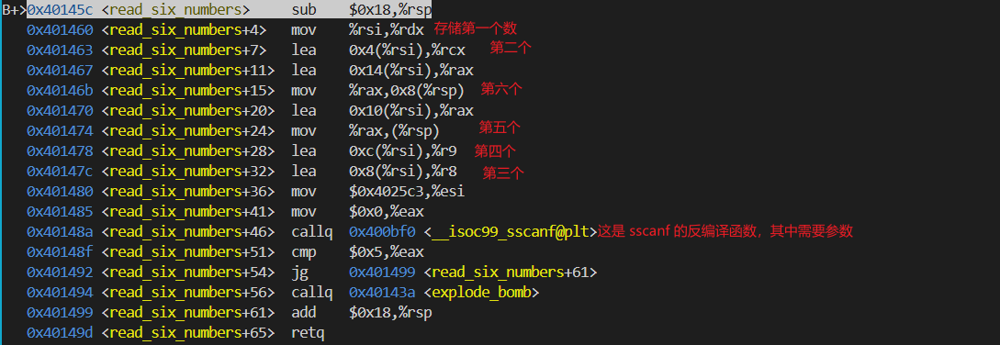
   其中 sscanf 需要的参数为：（输入的字符串，字符串要解析的格式，解析后存储的位置1，位置2...)
   可通过 gdb 去验证自己解析的数据都是对应的哪个地址

2. 解析完成之后紧接着就会判断第一个数据是否是 0x1
   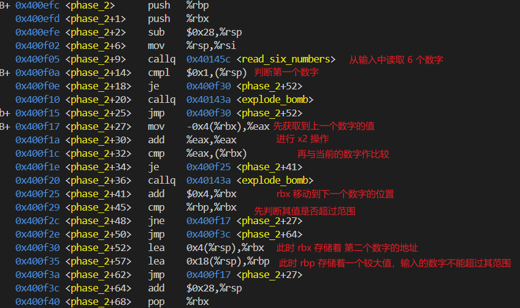
   从此函数可以发现，其中存在一个循环，rbp 作为终止条件，每次rbx 增加 4，代码着一个数字存储的地址，然后通过判断当前数字是否是前一个数字的两倍来作为条件是否引爆炸弹。
   那最终的结果就是：`1 2 4 8 16 32`

## phase_3

1. 根据上一个炸弹的经验，这里仍需要输入至少 两 个数据，然后会判断输入的第一个数 是否是 <= 7 的，如果是，则跳转到对应的位置去判断第二个数，其实就是对 switch...case... 的汇编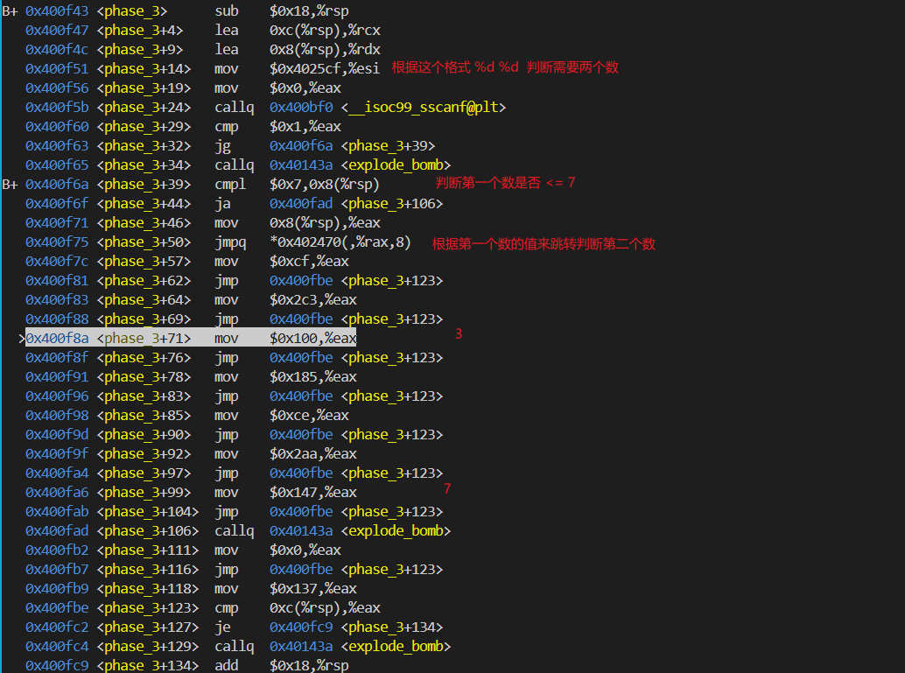

   ```c++
   switch (第一个数) {
       case 0:
           ...
           break;
       case 1:
           ...
           break;
       case 2:
           ...
           break;
       case 3:
           ...
           break;
       case 4:
           ...
           break;
       case 5:
           ...
           break;
       case 6:
           ...
           break;
       case 7:
           ...
           break;
       default:
           explode_bomb(); // 引爆炸弹
   }
   ```

2. 答案：任意组合即可

| 第一个数 |   第二个数    |
| :------: | :-----------: |
|    0     | `0xcf` (207)  |
|    1     | `0x137` (311) |
|    2     | `0x2c3` (707) |
|    3     | `0x100` (256) |
|    4     | `0x185` (389) |
|    5     | `0xce` (206)  |
|    6     | `0x2aa` (682) |
|    7     | `0x147` (327) |

## phase_4

1. 同样需要两个数字，并且根据判断第一个数字应该 <= 14，这里使用的 jbe 无符号比较的方式，而 jle 是有符号的 <= 比较；

2. 调用了一个 func4(输入的第一个数，0,14) 函数，这是一个递归函数🥲，遇见一个指令为 shr 表示右移并将右移新出来的位填充0，但是 sar 则是算术右移，高位天填充符号位

   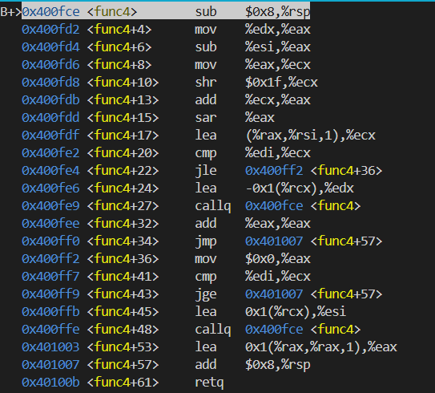
   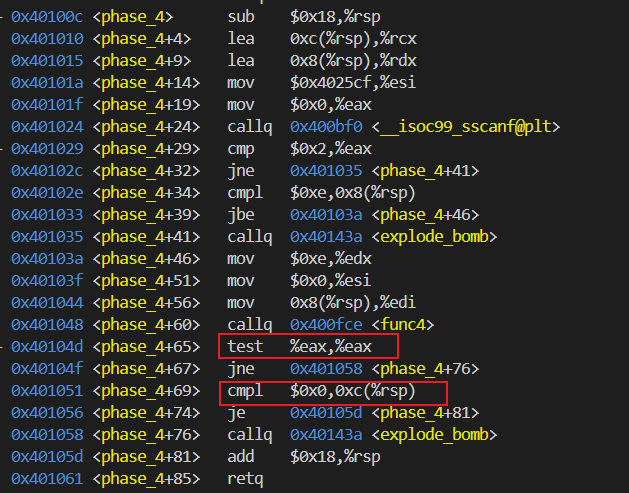

3. 以下是对汇编代码的简单翻译，可以看出来其实是个二分函数，要找的值就是 第一个数，范围是在 b ~ c 之间，但是从 phase_4 函数中得到，最终需要 res 的值为 0 ，因此在二分函数中，res 要以0 结束，那么最快的方法即，让第一个数在第一次就能够找到，即 为 7；

4. 判断第一个数之后，第二个数只是跟 0 做了比较，如果相同则让其能够通过，因此答案为 `7 0`

```c++
void func(int a, int b, int c) {
    // 首次调用时对应的值为 输入的第一个数，0，14；
    int res = c - b;
    int d = res;
    // 获取 d 的符号位
    int f = 0;
    if(d < 0) f = 1;
    res += f;
    res = res >> 1;
    d = res + b * 1;
    if(a == d){
        res = 0;
    } else if (a > d) {
        b = d + 1;
        func(a, b, c);
        res = res * 2 + 1;
    } else if(a < d) {
        c = d - 1;
        func(a, b, c);
        res += res;
    }
    return ;
}
```

## phase_5

**汇编讲解**

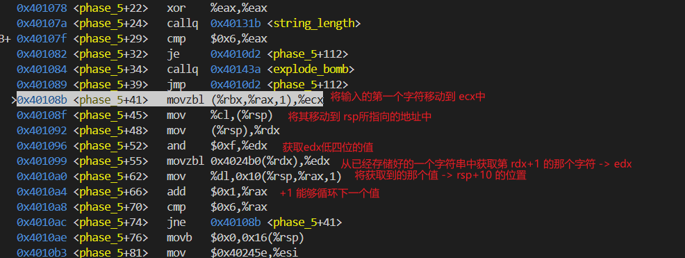

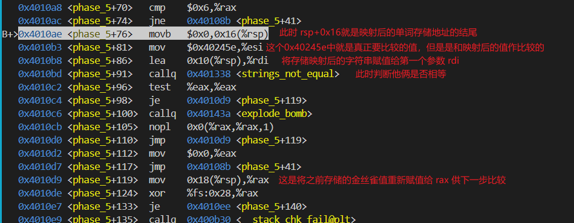

0x4024b0 地址存储的字符串 “maduiersnfotvbyl”

| 映射后的值 | 偏移量 | 对应输入的值 | 对应存储的位值 |
| :--------: | :----: | :----------: | :------------: |
|     f      |   9    |      i       |   rsp + 0x10   |
|     l      |   15   |      o       |   rsp + 0x11   |
|     y      |   14   |      n       |   rsp + 0x12   |
|     e      |   5    |      e       |   rsp + 0x13   |
|     r      |   6    |      f       |   rsp + 0x14   |
|     s      |   7    |      g       |   rsp + 0x15   |

最终结果就可以是：ionefg、yO^uvw（即 满足地位的值是偏移量的值）

第5个炸弹的整体思路：

1. 判断需要输入多少个字符串；
2. 针对输入的字符串是怎么处理的？
3. 处理完了之后又是跟谁作比较的？
4. 最后就是反推需要输入什么；

## phase_6

**汇编解析**

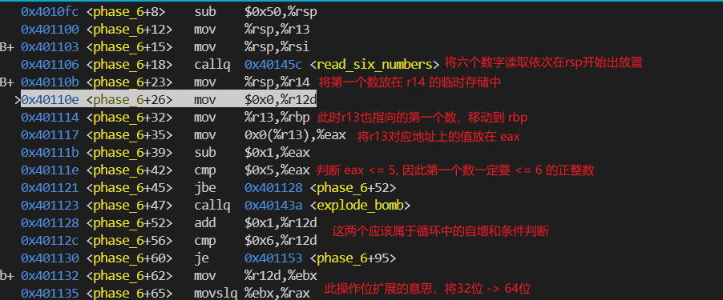

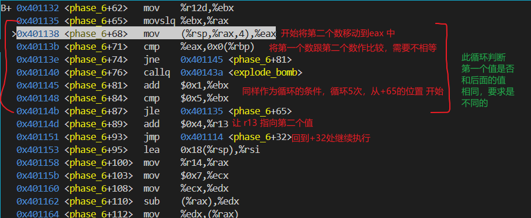

```c++
// +32 ~ +87 针对输入的数据做的处理类以下：

for(int i = 1;i <= 6;i++) {
    for(int j = i+1;j <= 6;j++) {
        if(a[i] == a[j]) {
            // 引爆炸弹
        }
    }
}
```

然后进入下一阶段处理：

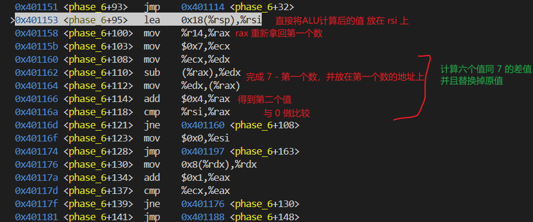

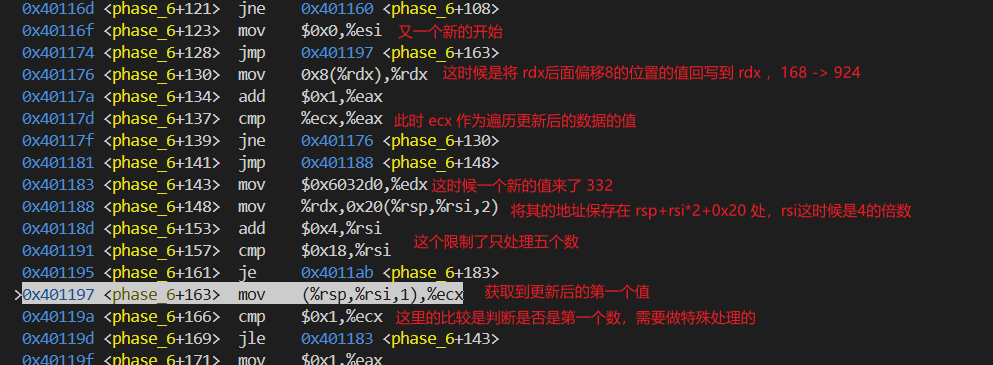

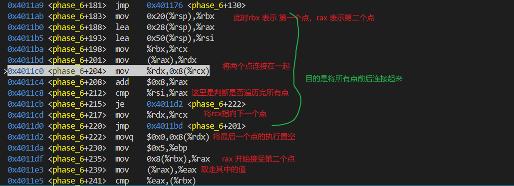

> node:  332, 1 -> 168, 2 -> 924, 3 ->  691,  4 -> 477, 5 -> 443, 6
>
> 正确的顺序？：924, 3  -->  691, 4  -->  477, 5  -->  443, 6  -->  332, 1  -->  168,2
>
> 3 4 5 6 1 2
>
> 4 3 2 1 6 5

此💣解题思路：

1. 在前两段代码解析中，整理出了一个双重循环的操作，即判断这六个数是否相同；
   由此判断，加上所有的数值不能超过 6，可知最终的数字一定是 1 2 3 4 5 6，这六个数，但是难点就在于其中怎么排序呢？
2. 再看下一个处理，这算是埋的一个坑吧，因为它将输入的数据分别换成与 7 的差值了，而没有直接用原始输入的数据去执行下面的操作；
3. 这时候就程序中会预先存储 六个node，从0x6032d0 开始的链表吧，后面会接六个node，此时关键的来了；
   在第四段代码的处理中，明显是重新构造了链表的顺序，此时是从 0x20(%rsp) 开始存储的，然后就是顺序的问题了，`mov 0x8(%rdx),%rdx; add $0x1,%eax; cmp %ecx,%eax` 可以细品这三个个操作，其中 **%ecx**是获取的当前输入更新后的值，**%rdx** 表示的是指向的节点，在遍历到节点是可以通过查找其 地址+4 位置的值，也是存在一个数值的，最初的数据是 1 2 3 4 5 6 这样的排列，此时的匹配就是通过 ecx 的值去找到对应的 node 然后存储在栈中，整个循环结束后，顺序是定了；
4. 开始下一步操作，将这些赋值好的节点进行连接；
5. 最后就开始判断连接的方式是否是正确的，也是从这里推断前面需要怎么连接的，判断方式就是，依次去两个节点，然后判断前一个节点的值是否 >= 后一个节点值；
6. 那最终炸弹就解除完毕了

## 最终完成结果

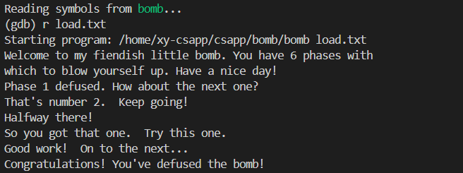


            2026年1月11日 23:20 完结